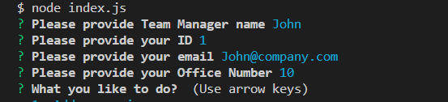

# Team Info Generator
## Description 

As a manager a user want to generate a webpage that displays my team's basic info so that a user have quick access to their emails and GitHub profiles.

## Table of Content

1. [Description](#description)
2. [Installation](#installation)
3. [Usage](#usage)
4. [Licence](#licence)
5. [Colaboration](#colaboration)
6. [Questions](#questions)

##  Installation 
* This application requires NODE.js server environment. You can find more about NODE.js here: 
[Link](https://nodejs.dev/en/learn/how-to-install-nodejs/) 
* Once you set your enviroment accordingly please run the program by typing: `node index.js` in your console

## Usage 
* Program will identify user as a Manager and asks relevant questions. 

    

* Then application will ask user for further instructions

    

* User can choose one of the three of following options:
    * `Add an engineer` to add engineer type of employee
    * `Add an intern` to add intern
    * `Finish building the team` to finish process, render results and shut down application

* Results of input can be seen by opening `team.html` file in `output` directory. 

    

## License 
MIT

## Colaboration 
This project is based on starting code provided by Trilogy Education Services. Part of code in `index.js` has been created under supervision.

## Questions 
[WloMac](https://github.com/WloMac)

If you have any further questions about this README Generetor do not hesitate to contact using this e-mail address: wmac.webdev@gmail.com

